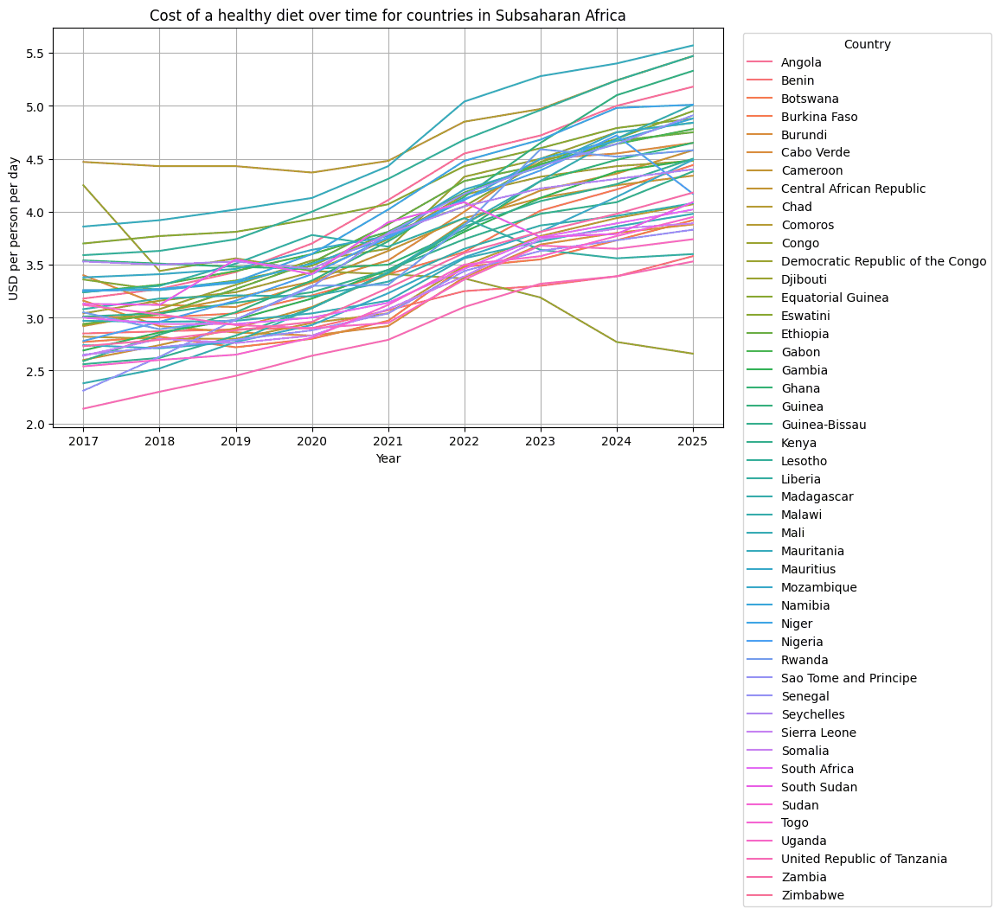
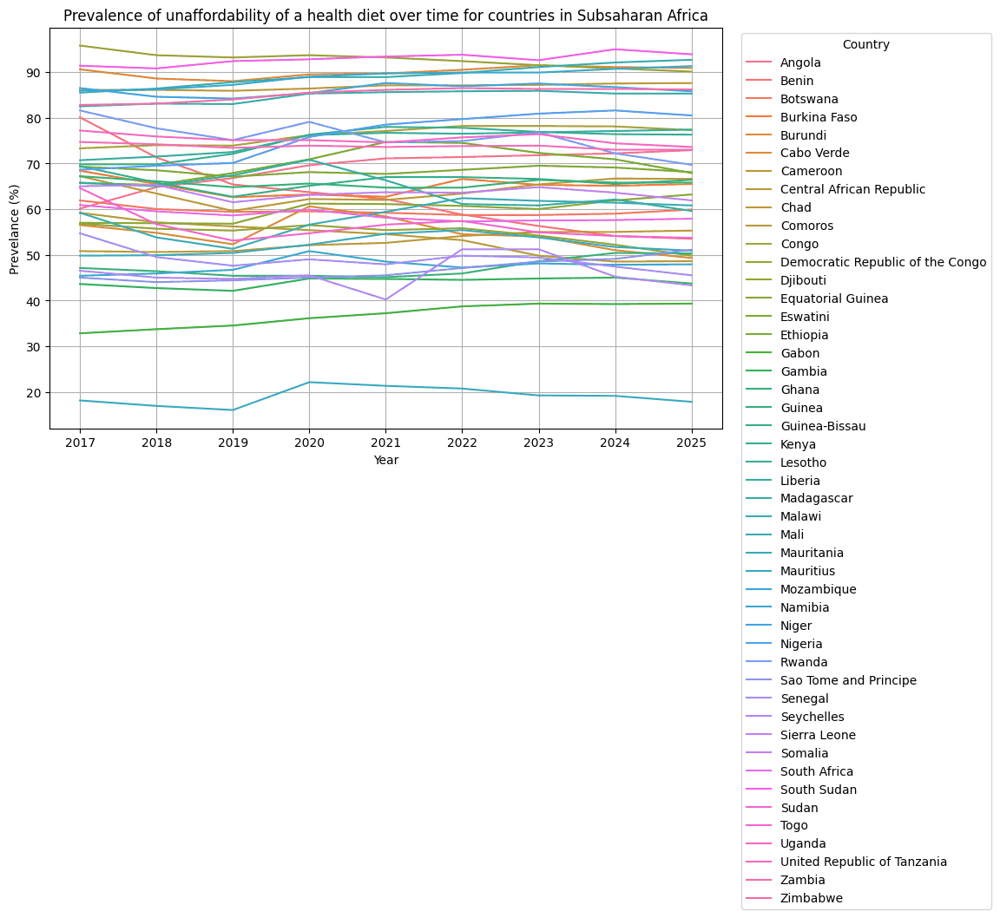

# faostat-diet-cost/

Alison's exploration of the FAOSTAT Cost and Affordability of a Healthy Diet: the cost of a healthy diet and the number and share of people unable to afford it, 2017 on, for the 49 countries; the per-food-group cost columns were dropped as 89% missing. [`FAOSTAT CoAHD Exploration.ipynb`](FAOSTAT%20CoAHD%20Exploration.ipynb) (Colab, outputs kept). Fed the `feat_pua_pct` sensitivity row.

