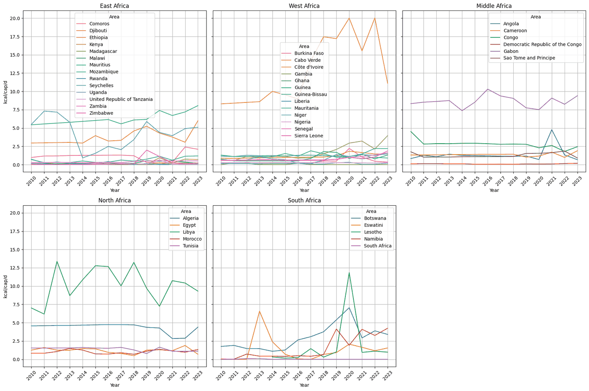

# faostat-food-balances/

Alison's exploration of the FAOSTAT Food Balances (2010 on): world population and calories per head, infant food, the extremes of calorie supply. [`Food Balances Exploration.ipynb`](Food%20Balances%20Exploration.ipynb) (Colab, outputs kept; FAOSTAT credentials come from the Colab secret store). Fed data slide 1.

