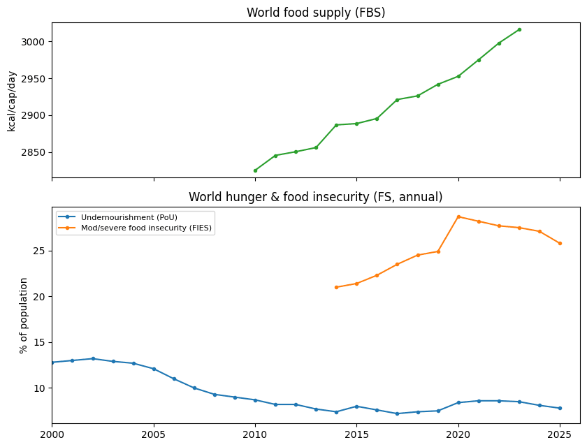
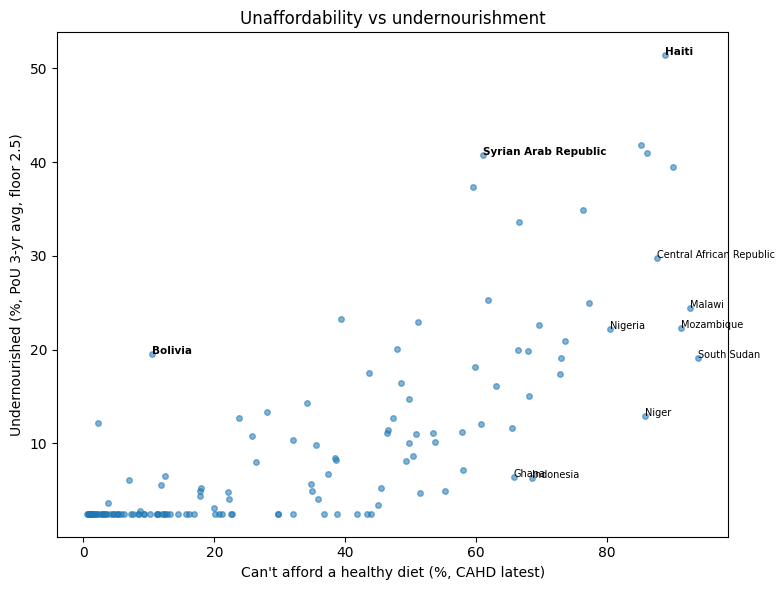

# faostat-overview/

Saarah's first pass over FAOSTAT in the datathon's first week, before the track was chosen: what each domain holds for the 49 countries, world supply against access, affordability against hunger, agrifood emissions, wheat trade concentration, cooking oils. [`faostat-overview.ipynb`](faostat-overview.ipynb) (Colab, outputs kept) — it is where the anaemia series and the country-year panel design were picked.

