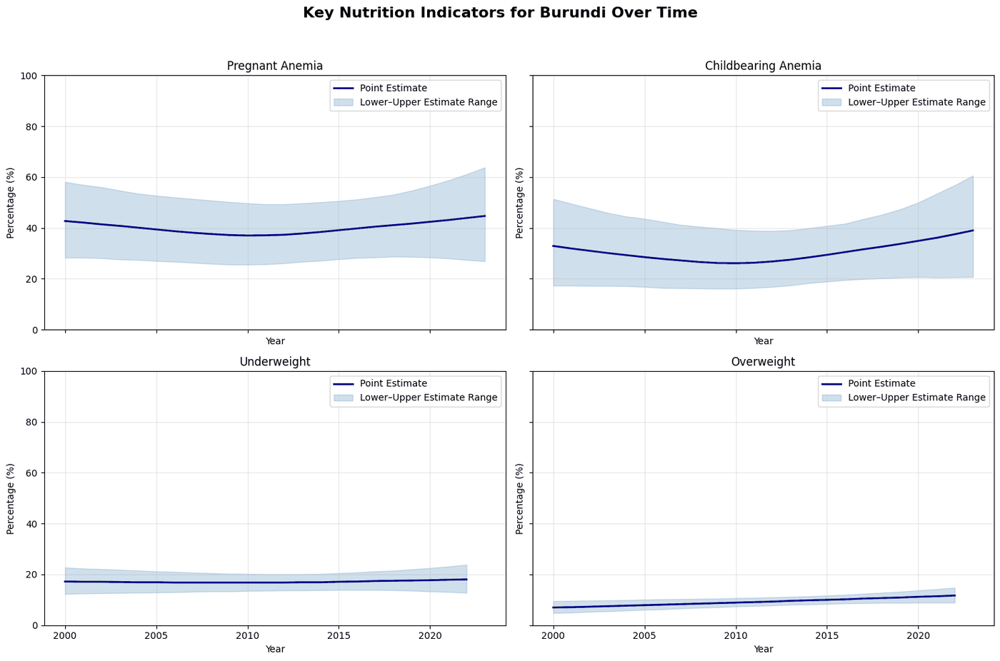

# womens-nutrition-unicef/

Alison's work on the UNICEF Global Database, Women's Nutrition — 194 countries: overweight, underweight, anaemia in women of childbearing age and in pregnancy, each pivoted, explored, and split into improving and stagnating or worsening countries, with choropleths over time. It is where the **concern score** was built: a flag per indicator (0 improved, 1 started in the worst quarter, 2 worsened) plus the country's percentile, averaged over the four indicators; three of the five most concerning countries were in sub-Saharan Africa, which set the region. [`Unicef_Women_s_nutrition.ipynb`](Unicef_Women_s_nutrition.ipynb) (Colab, outputs kept). Reproduced on the 49 countries in [`scaffold/08_concern_score.py`](../../scaffold/08_concern_score.py).

